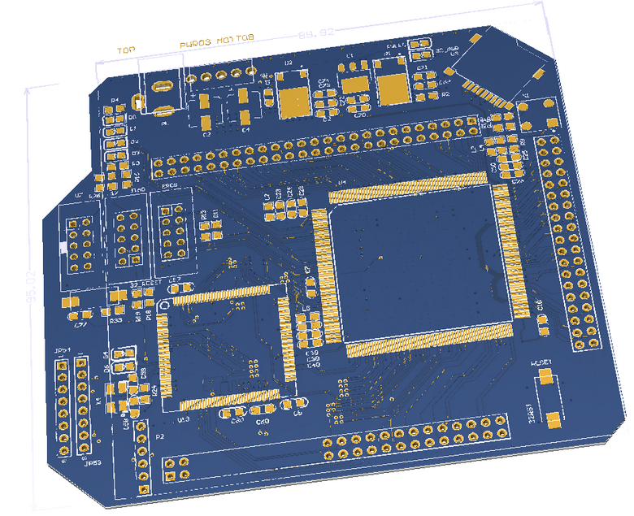

# ZJUNlict Core Board (FPGA and STM32)

The core board (FPGA and STM32) is the improvment
(The board is designed using [Altium Designer](https://www.altium.com/altium-designer/) 17.1)

The main features are:

* Add a STM32F407 to handle the communication and robot configuration.
* STM32 communicates with FPGA using flexible static memory controller.
* Compatible interface with current [mother board](https://github.com/ZJUNlict/Mother_Board) and [main board (test)](https://github.com/ZJUNlict/Main_Board_Test).

Detailed information also can be found in our teams's [2018 ETDP](https://zjunlict.cn/?page_id=54)